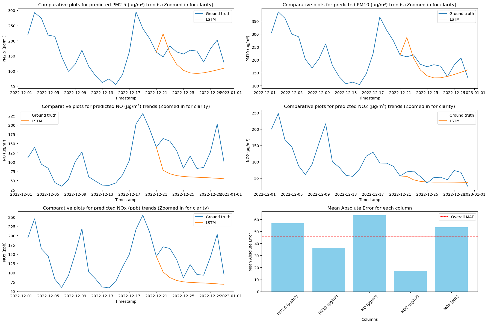
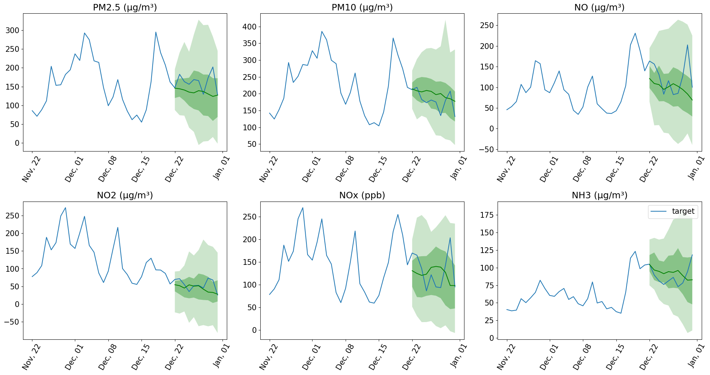
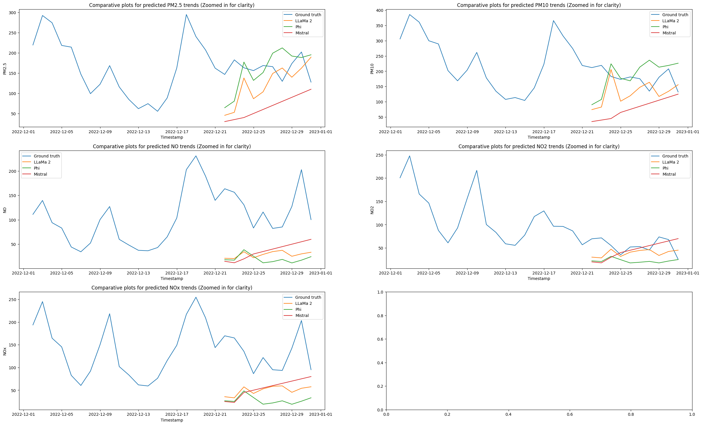
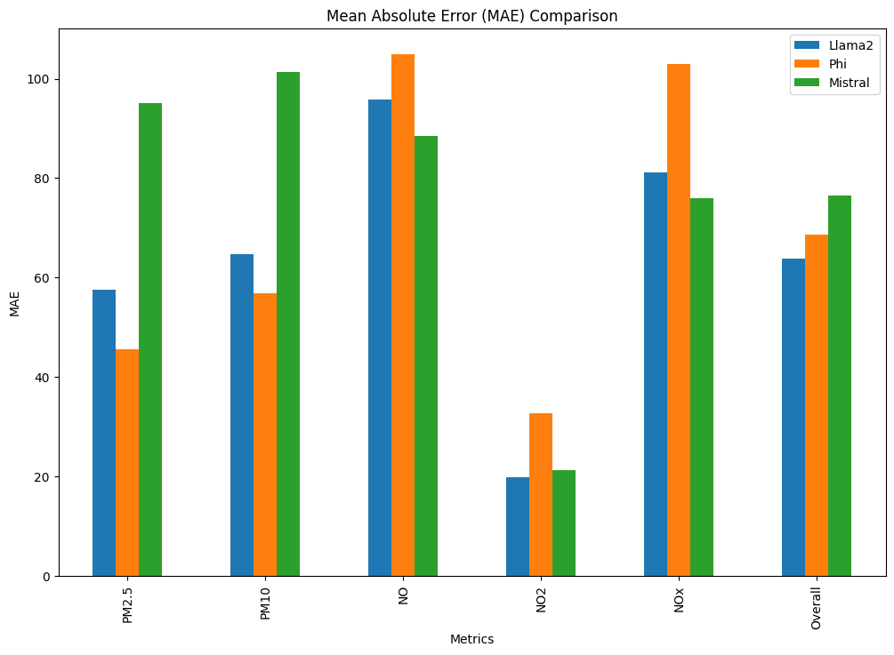

# Air-quality forecasting using LLMs and LSTM

This project aims to analyze the zero-shot time-series forecasting performance of LLMs like Mistral, LLaMa2, and Phi using Ollama. The performance is compared with baseline multi-variate LSTM and Lag-Llama foundation model which is specialised for time-series forcasting. The data is taken from the Delhi-ITO station available at https://cpcb.nic.in/automatic-monitoring-data/ 

## Table of Contents
- [Project Title](#project-title)
- [Video Description](#video-description)
- [Description](#description)
- [Results](#results)

## Video Description

  <video width="700" controls>
    <source src="img/video.mp4" type="video/mp4">
    Your browser does not support the video tag.
  </video>

## Description

 - For a baseline benchmark, a multilayer LSTM is contructed with fc layers at the end for multi-variate prediction. The training is done on data from 2020, 2021. The data from 2019 is used as a validation dataset to check for overfitting. The metrics are calculated on the predcitions on the last 10 days of 2022 given the data of the past 100 days.

 - Lag-Llama foundation model is specialized for time-series forecasting and is used to set a benchmark for zero-shot prediction.

 - LLMs like Mistral, LLaMa2, and Phi using Ollama are used to see how general LLMs perform on zero-shot forecasting tasks. 

## Results

 - Lag-LLama seemed to perform the best on zero-shot performace. 
 - Mistral performed the best among the LLMs from Ollama.
 - The LSTM performed well but was very easy to overfit especially on only 2 years of data

  
   
  <em>Figure: LSTM Predictions</em>

  
   
  <em>Figure: Lag-Llama Predictions</em>

  
   
  <em>Figure: LLMs Predictions</em>

  
   
  <em>Figure: LLMs Mean Absolute Error</em>

